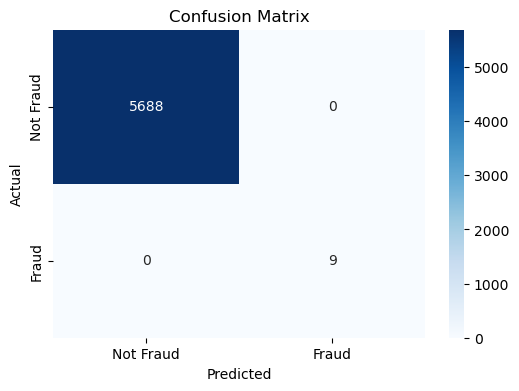
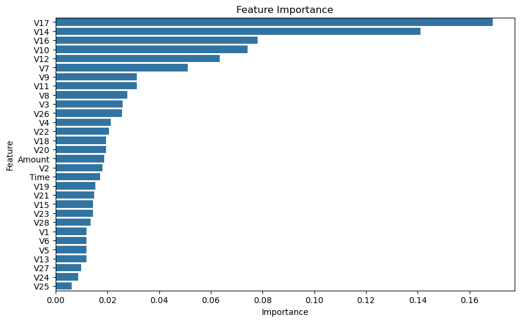

# Credit Card Fraud Detection

## Objective
Detect fraudulent transactions in credit card data using machine learning techniques. This project leverages data preprocessing, feature scaling, and classification algorithms to accurately identify fraud while minimizing false positives.

---

## Dataset
- **Source:** [Kaggle Credit Card Fraud Detection Dataset](https://www.kaggle.com/mlg-ulb/creditcardfraud)
- **Description:** Contains 284,807 transactions with 492 fraud cases (highly imbalanced dataset).
- **Attributes:** 30 numerical features (V1-V28, Amount, Time) and the target variable (`Class`):
  - `Class = 1`: Fraudulent
  - `Class = 0`: Non-fraudulent

---

## Project Workflow
1. **Data Preprocessing**
   - Handled class imbalance using SMOTE.
   - Scaled numerical features using `StandardScaler`.
   - Splitted data into training and testing sets.

2. **Model Training**
   - Algorithms: Logistic Regression, Random Forest, XGBoost.
   - Used GridSearchCV for hyperparameter tuning.

3. **Evaluation**
   - Metrics: ROC-AUC score, precision, recall, F1-score.
   - Plotted confusion matrix, feature importance, and ROC curve.

4. **Results**
   - Achieved a high ROC-AUC score of **0.99** with XGBoost.

---

## Results
### Confusion Matrix


### ROC Curve


### Feature Importance


---

## Installation
1. Clone this repository:
   ```bash
   git clone https://github.com/<your-username>/credit-card-fraud-detection.git
   ```

2. Navigate to the project directory:
   ```bash
   cd credit-card-fraud-detection
   ```

3. Install dependencies:
   ```bash
   pip install -r requirements.txt
   ```

4. Download the dataset:
   - Place `creditcard.csv` in the `data/` folder.

---

## Usage
### Run the Jupyter Notebook
1. Launch Jupyter Notebook:
   ```bash
   jupyter notebook
   ```
2. Open and execute the notebook in `notebooks/fraud_detection.ipynb`.

### Modular Scripts
- Preprocess data:
  ```bash
  python src/preprocess.py
  ```
- Train and evaluate models:
  ```bash
  python src/model.py
  ```
- Generate evaluation metrics:
  ```bash
  python src/evaluation.py
  ```

---

## Technologies Used
- Python: 3.9
- Libraries:
  - `pandas`, `numpy` for data manipulation
  - `matplotlib`, `seaborn` for visualization
  - `scikit-learn`, `imbalanced-learn`, `xgboost` for machine learning

---

## Contributing
Feel free to submit issues or pull requests. Contributions are welcome!

---

## License
This project is licensed under the MIT License. See the LICENSE file for details.

---

## Acknowledgments
- Kaggle dataset: ULB Machine Learning Group.
